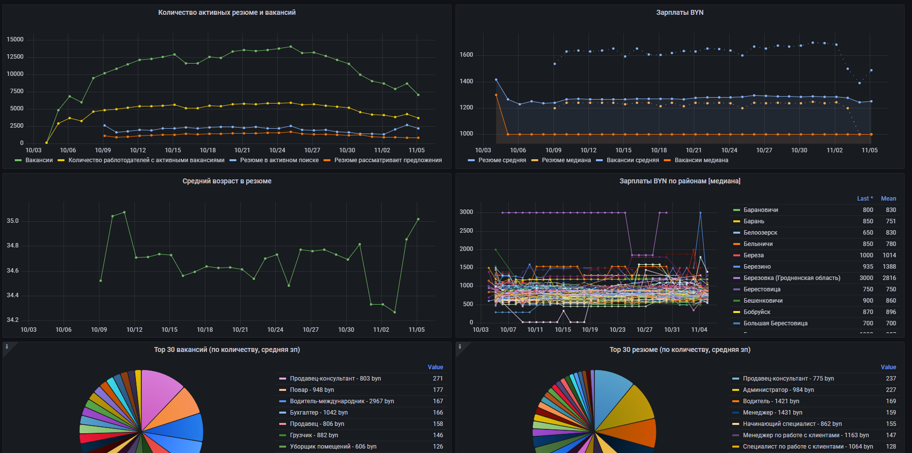
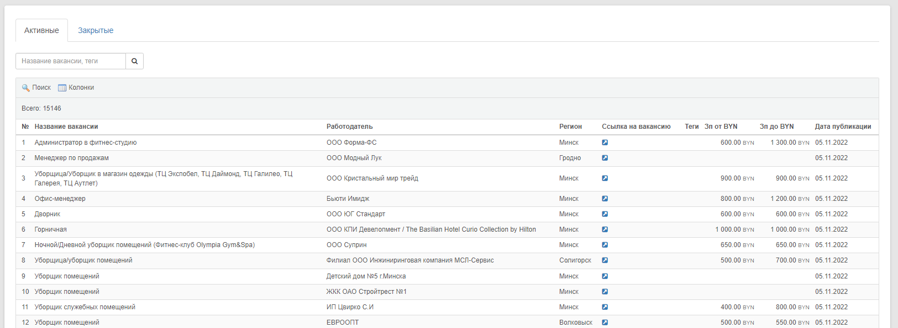
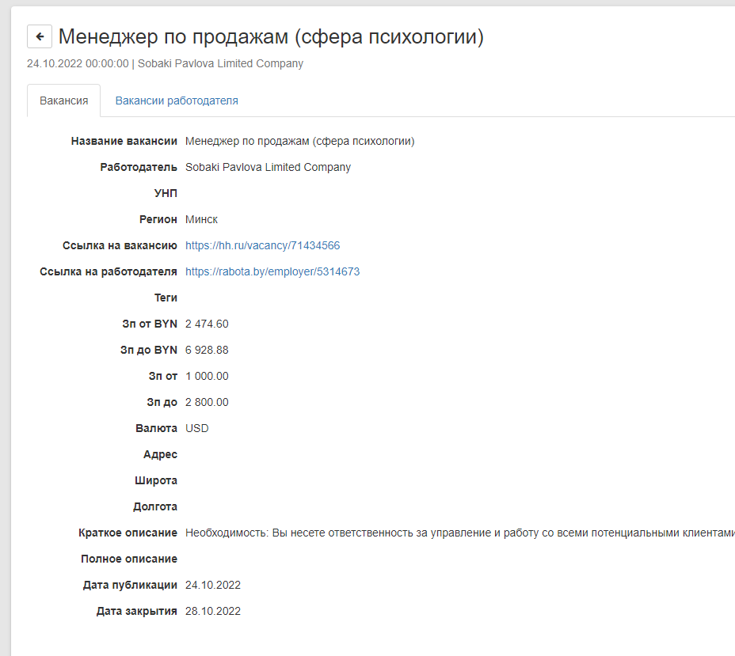
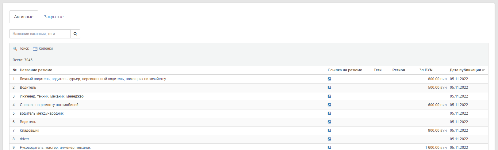
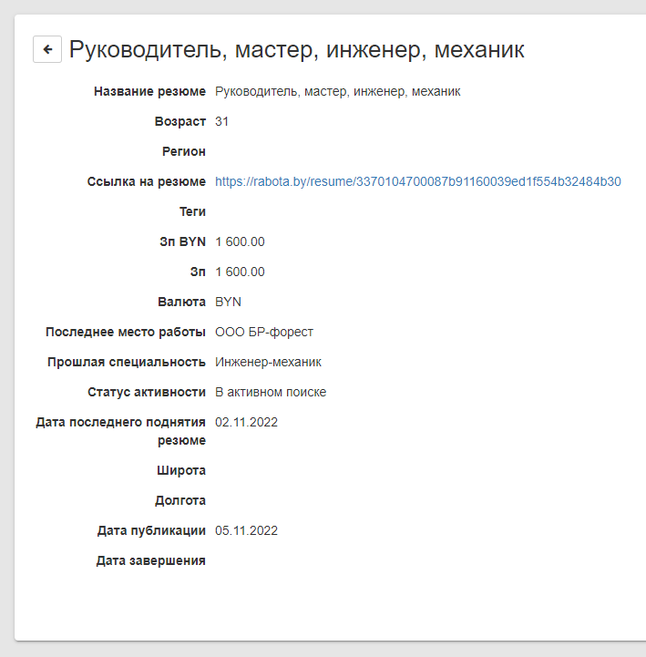
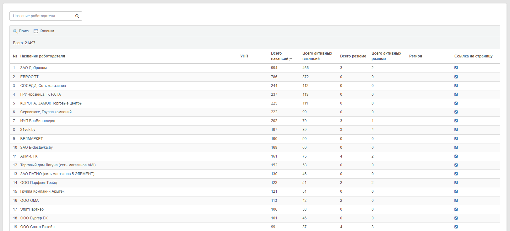
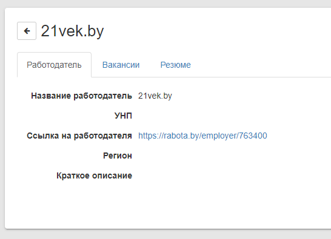

# Работы

Получение и анализ информации о вакансиях и резюме

## Функции

- Получение данных о вакансиях с rabota.by
- Получение данных о резюме с rabota.by
- Получение данных о работодателях с rabota.by
- Вывод данных в виде множества наглядных графиков в системе Grafana

[Конфигурация для создания дешборда в Grafana](docs/img/grafana-dashboard.png)

## Примеры

Grafana за 30 дней

**Интерфейс модуля**

Вакансии

Резюме

Работодатели

